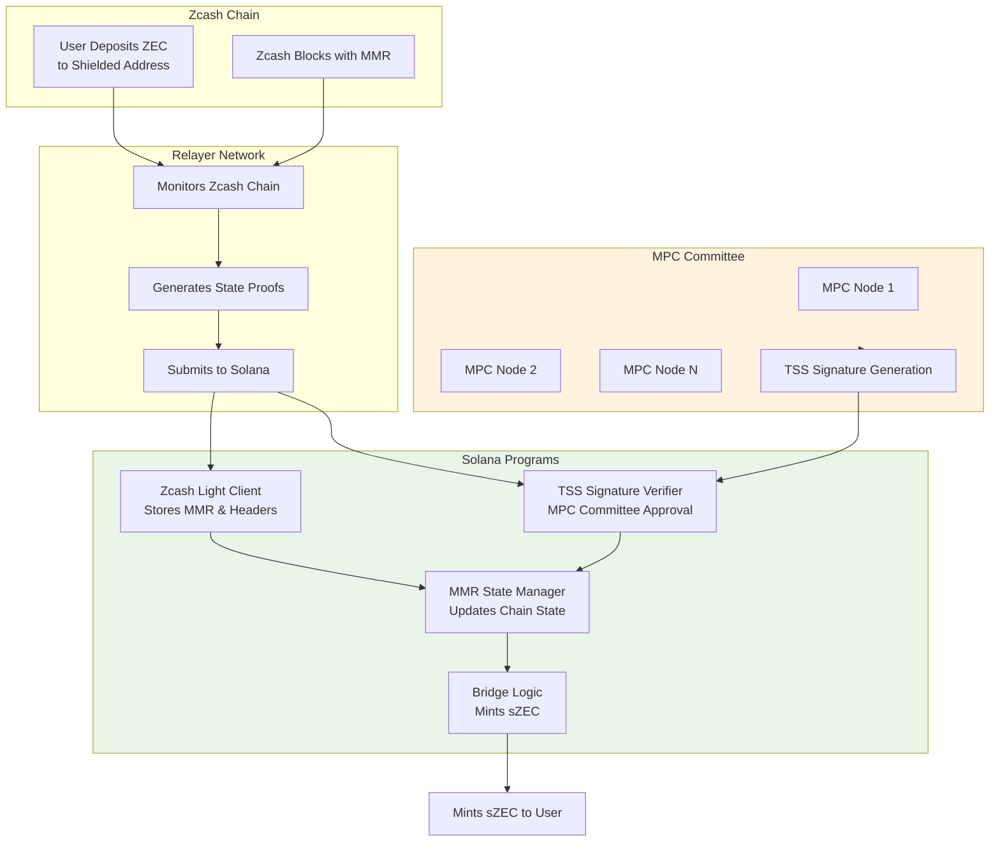

# Bridge

## Solana to Zcash

The verification is based on our [MPC Protocol](./mpc.md).

## Zcash to Solana

The verification is based on [ZIP-221][zip221].

[zip221]: https://zips.z.cash/zip-0221
