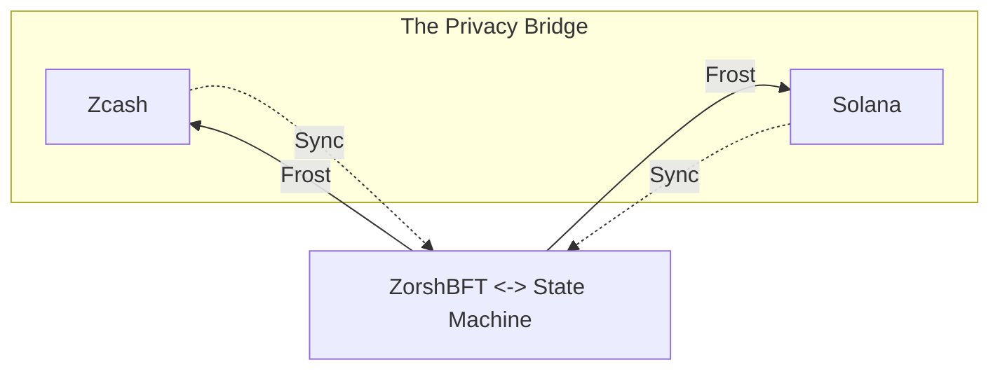

# Zosh

The trustless privacy bridge for Solana and Zcash.

- **Security**: The funds in the [bridge](/bridge) are secured by [the zosh Protocol](/consensus.md).

  - No custody wallet, everything on-chain.
  - [frost][frost] to manage the zcash orchard pool.
  - `multi-sig` to manage the zoZEC on the solana side.

- **Privacy**: The privacy is ensured by the [orchard][orchard] pool from zcash.
  - On bridging ZEC to SOL, zosh doesn't know the depositor of ZEC.
  - On bridging SOL to ZEC, zosh sends the funds back to the orchard pool.

Check out [bridge](/bridge) and [demo](/demo.md) for more details.

## Why Zosh?

| Bridge       | Privacy | Open Source | Trustless | Permissionless | Scalability |
| ------------ | ------- | ----------- | --------- | -------------- | ----------- |
| Zosh         | 🟢      | 🟢          | 🟢        | 🟢             | 🟢          |
| Near Intents | 🔴      | 🟡          | 🟡        | 🔴             | 🟢          |
| Zenrock      | 🟢      | 🔴          | 🟡        | 🔴             | 🔴          |

## Technical Overview

zosh is a Solana L2 built for Zcash that focus on privacy and scalability.

zosh uses a custom consensus algorithm called [zoshBFT](/zoshbft.md) inspired by Hotstuff and
its successors. Both the algorithm and networking stack are optimized from the ground up to
support the unique demands of the crossing chain liqudity and privacy.

zosh state execution is heavily based on external transactions, all confirmed output transactions
will be committed on chain and finally can be executed by anyone.

[frost]: https://frost.zfnd.org/
[orchard]: https://zcash.github.io/orchard/
