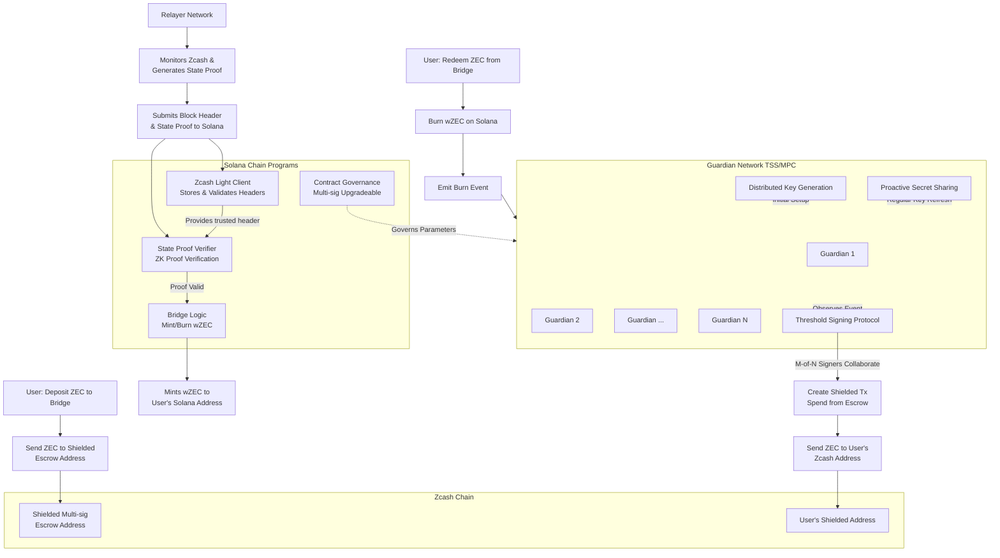

# ZypherBridge

The privacy bridge for Solana and Zcash.

### Development Links

- [zecfaucet][faucet]
- [zcash testnet][zectestnet]
- [zcash RPC][rpc]
- [zcash explorer][explorer]

[explorer]: https://mainnet.zcashexplorer.app/
[rpc]: https://zcash.github.io/rpc/
[faucet]: https://testnet.zecfaucet.com/
[zectestnet]: https://blockexplorer.one/zcash/testnet
