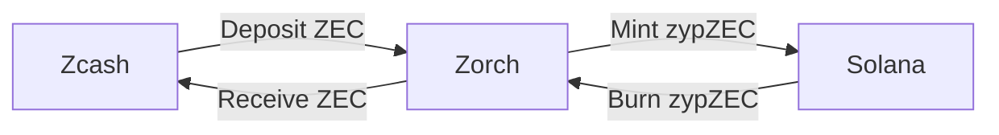

# Zorch

The trustless privacy bridge for Solana and Zcash.

## Security

The funds in the [bridge](/bridge) are secured by [the Zorch Protocol](/consensus.md).

- No custody wallet, everything on-chain.
- [frost][frost] to manage the zcash orchard pool.
- `multi-sig` to manage the zrcZEC on the solana side.

## Privacy

The privacy is ensured by the [orchard][orchard] pool from zcash.

- On bridging ZEC to SOL, Zorch doesn't know the depositor of ZEC.
- On bridging SOL to ZEC, Zorch sends the funds back to the orchard pool.

[frost]: https://frost.zfnd.org/
[orchard]: https://zcash.github.io/orchard/
