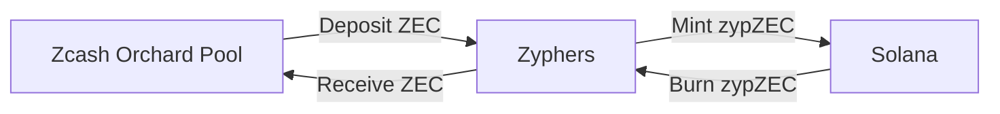

# Zyphers

The trustless privacy bridge for Solana and Zcash.

## Security

The funds in the [bridge](/bridge/README.md) are secured by [the zyphers network](/network/README.md),
technically:

- [frost][frost] to manage our zcash orchard pool.
- multiple signatures to manage the zypZEC on the solana side.

## Privacy

The privacy is ensured by the orchard pool from zcash.

- On bridging ZEC to SOL, Zyphers doesn't know the depositor of ZEC.
- On bridging SOL to ZEC, Zyphers sends the funds back to the orchard pool.

[frost]: https://frost.zfnd.org/
