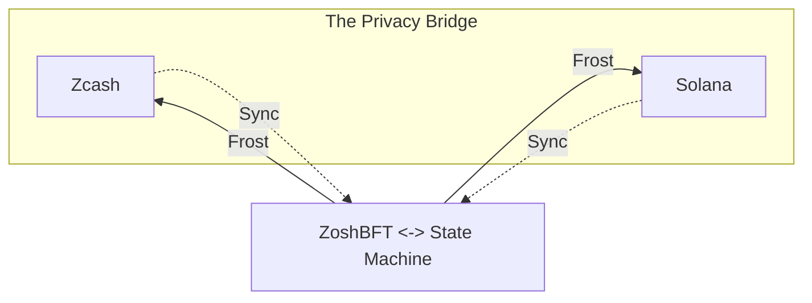

# Zosh

The trustless privacy bridge for Solana and Zcash.

- **Privacy**: Zcash orchard pool integrated.
- **Trustless**: No centralized custody, on-chain MPC
- **Permissionless**: Any Solana holder can be a validator.

## Why Zosh?

| Bridge       | Privacy | Open Source | Trustless | Permissionless | Scalability |
| ------------ | ------- | ----------- | --------- | -------------- | ----------- |
| Zosh         | 🟢      | 🟢          | 🟢        | 🟢             | 🟢          |
| Near Intents | 🔴      | 🟡          | 🟡        | 🔴             | 🟢          |
| Zenrock      | 🟢      | 🔴          | 🟡        | 🔴             | 🔴          |

## Technical Overview

Zosh is a Solana L2 built for Zcash that focus on privacy and scalability.

Zosh uses a custom consensus algorithm called [zoshBFT](/./protocol/zoshbft.md) inspired by Hotstuff and
its successors. Both the algorithm and networking stack are optimized from the ground up to
support the unique demands of the crossing chain liquidity and privacy.

zosh state execution is heavily based on external transactions, all confirmed output transactions
will be committed on chain and finally can be executed by anyone.

[frost]: https://frost.zfnd.org/
[orchard]: https://zcash.github.io/orchard/
