# Bundle

Bridge transaction bundling is the end-to-end process of aggregating cross-chain transfer requests and executing them with validator consensus. This process involves collectors, validators, the mempool, and network coordination.

## Overview

Bundling transforms individual bridge requests into batched, threshold-signed transactions ready for execution on the target chain. The process ensures trustless operation - every validator independently verifies events, and 2/3 consensus is required before execution.

## Architecture

```mermaid
flowchart LR
    subgraph Collectors
        A[Monitor Zcash<br/>Orchard Pool]
        B[Monitor Solana<br/>Program Logs]
    end
    
    subgraph Validators
        C[Detect Bridge<br/>Events]
        D[Create Bundles]
        E[Sign Bundles]
    end
    
    subgraph Network
        F[Gossip Bundles]
        G[Aggregate<br/>Signatures]
    end
    
    subgraph Mempool
        H[Queue Bundles]
        I[Track Threshold]
        J[Mark Completed]
    end
    
    A --> C
    B --> C
    C --> D
    D --> F
    F --> H
    H --> E
    E --> G
    G --> I
    I -->|2/3 reached| J
    J --> K[Leader Packs<br/>into Block]

    style H fill:#4a5568,stroke:#718096,stroke-width:2px
    style J fill:#2d3748,stroke:#48bb78,stroke-width:2px
    style K fill:#2c5282,stroke:#63b3ed,stroke-width:2px
```

## Workflow

### 1. Collection Phase

**Components:** [Collectors](../collectors.md)

Each validator runs collectors monitoring both chains:

- **Zcash collector**: Scans orchard pool for shielded transactions with Zosh memo fields
- **Solana collector**: Monitors program logs for zoZEC burn events

Collectors detect bridge events and convert them to bridge requests containing:
- Source transaction ID
- Target chain recipient address
- Transfer amount
- Chain routing (source/target)

### 2. Bundle Creation

**Components:** Validators

Validators aggregate bridge requests into bundles:

- **Solana bundles**: Maximum 10 requests per bundle (transaction size limit)
- **Zcash bundles**: Limited by available notes in the orchard pool

Each bundle includes:
- Array of bridge requests
- Target chain identifier
- Serialized transaction data
- Empty signatures array (to be filled)

Bundle hash computed: `BLAKE3(bundle_data)`

### 3. Network Propagation

**Components:** [Network](./network.md)

Bundles gossiped to all validators via QUIC:

- Each validator receives bundle proposal
- Validators verify bundle validity (valid source txs, correct target chain)
- Network ensures all validators see consistent bundle set
- Invalid bundles rejected before mempool

### 4. Signature Collection

**Components:** [Mempool](./mempool.md) + [Network](./network.md)

Validators independently sign and propagate signatures:

1. Bundle queued in mempool (in-progress state)
2. Each validator computes bundle hash and signs with Ed25519 key
3. Signatures broadcast via network to all validators
4. Mempool tracks signature count per bundle hash
5. Network aggregates signatures from multiple validators

### 5. Threshold Achievement

**Components:** [Mempool](./mempool.md)

When bundle reaches 2/3 validator signatures:

- Bundle transitions: in-progress → completed
- Bundle ready for block inclusion
- Completed bundles stored in mempool until next block

**Example threshold calculation:**
- 4 validators: 3 signatures required
- 7 validators: 5 signatures required
- 10 validators: 7 signatures required

### 6. Block Inclusion

**Components:** [Block](./block.md) Production

Leader packs completed bundles into block:

1. Leader selected via VRF
2. Leader calls `mempool.pack()` to drain completed bundles
3. Bundles included in block extrinsic
4. Block propagated for consensus
5. Once block finalized, bundles executed on target chain

## Bundle Execution

After block finalization, bundles execute on the target chain:

1. Validator constructs target chain transaction with bundle data
2. MPC signs transaction using threshold signatures (FROST for Zcash)
3. Transaction submitted to target chain
4. Target chain processes transfer (Solana: mint zoZEC, Zcash: create shielded output)
5. Receipt generated linking source tx → target tx

**Chain-specific limits:**
- Solana: Batch up to 10 recipients per transaction
- Zcash: Limited by available notes in orchard pool

## Failure Handling

Bundles may fail to complete for several reasons:

### Insufficient Signatures

- Bundle remains in-progress if threshold not reached
- Persists across blocks until threshold met
- May be included in future block once signatures collected

### Execution Failure

- Target chain rejects transaction (insufficient funds, invalid recipient, etc.)
- Bundle marked as unresolved
- Validators may retry in future block
- Dispute mechanism (planned) allows challenging failed bundles

### Invalid Bundle

- Detected during verification phase
- Rejected before mempool queuing
- Never reaches signature collection
- Malicious bundler may be slashed (future)

## Security Properties

The bundling process ensures:

1. **Trustless verification**: Every validator independently verifies source chain events via collectors
2. **Threshold security**: 2/3 consensus required, tolerates up to 1/3 Byzantine validators
3. **No single point of failure**: Distributed collectors, no centralized oracle
4. **Censorship resistance**: Any validator can propose bundles, leader cannot censor
5. **Execution atomicity**: All requests in bundle execute together or none execute

## Performance Considerations

### Batch Efficiency

- Solana: 10 requests per bundle reduces transaction count 10x
- Zcash: Variable bundle size based on orchard pool state
- Larger batches reduce per-request overhead

### Latency

Bundle processing time:
1. Collection: ~1 block confirmation (Zcash: ~75s, Solana: ~400ms)
2. Bundling + signing: ~1-2 zoshBFT rounds
3. Block inclusion: Next block slot
4. Execution: Target chain confirmation time

Total latency typically 2-5 minutes depending on chain confirmations.

### Throughput

Limited by:
- Target chain transaction size (Solana: 10 per bundle)
- Source chain note availability (Zcash: depends on orchard pool)
- Validator signature speed (Ed25519 signing: ~50k/sec per validator)

## Related Documentation

- [Collectors](../collectors.md): Off-chain monitoring infrastructure
- [MemPool](./mempool.md): Bundle state management and packing
- [Network](./network.md): QUIC-based bundle propagation
- [Transaction](./transaction.md): Bridge request and receipt structure
- [Block](./block.md): Block production and extrinsic inclusion
