# MemPool

The mempool manages pending transactions before they are included in blocks. It handles two types of transactions: bridge bundles and receipts, coordinating signature aggregation for bridge operations.

## Architecture

The mempool consists of two components:

- **Bridge Pool**: Manages bridge bundles with threshold signature aggregation
- **Receipt Queue**: Stores receipt transactions awaiting inclusion

## Bridge Pool States

Bridge bundles progress through three states in the mempool:

1. **Queued**: Bundle submitted to mempool, awaiting validator signatures
2. **In-Progress**: Collecting validator signatures until threshold (2/3) is reached
3. **Completed**: Threshold met, ready for block inclusion

## Process Flow

```mermaid
flowchart LR
    A[Collectors<br/>detect events] --> B[Create<br/>bundles]
    B --> C[Queue in<br/>mempool]
    C --> D[Validators<br/>sign]
    D --> E{Threshold?}
    E -->|No| D
    E -->|Yes| F[Completed]
    F --> G[Leader<br/>packs]
    G --> H[Execute on<br/>target chain]

    style C fill:#4a5568,stroke:#718096,stroke-width:2px
    style F fill:#2d3748,stroke:#48bb78,stroke-width:2px
    style H fill:#2c5282,stroke:#63b3ed,stroke-width:2px
```



> See [Bundle](./bundle.md) for the complete end-to-end bundling workflow involving collectors, validators, network, and mempool.

## Signature Aggregation

The bridge pool aggregates threshold signatures before execution:

1. Bundle submitted with `bundle.queue([bundles])`
2. Validators independently verify and sign the bundle hash
3. Signatures collected via `bundle.complete(bundle_hash, signature)`
4. When `signatures.len() >= threshold`, bundle moves to completed state
5. Leader includes completed bundles in next block

**Threshold:** 2/3 of validator signatures required (e.g., 3 of 4 validators, 7 of 10 validators)

## Receipt Queue

Receipts are simpler than bridge bundles - they don't require signature aggregation. When a bridge bundle executes successfully on the target chain, validators generate receipts and add them directly to the queue.

Receipts are drained when the leader packs the mempool into a block extrinsic.

## Packing

When a validator becomes the block leader, they pack the mempool:

```rust
extrinsic = mempool.pack()
// Returns:
// - bridge: All completed bundles (cleared from completed map)
// - receipts: All queued receipts (drained from queue)
```

The pack operation is atomic - all completed transactions are included in the block or none are.

## Validation

Before adding to mempool, validators verify:

- **Bridge bundles**: Valid source chain transaction, correct target chain
- **Receipts**: Matching anchor transaction exists, valid target chain confirmation

Invalid transactions are rejected and never enter the mempool.
