# ZoshBFT

ZoshBFT is Zosh's BFT consensus algorithm combining [HotStuff](https://arxiv.org/abs/1803.05069) for BFT consensus with [Safrole](https://wiki.polkadot.network/docs/learn-safrole) (from Polkadot JAM) for VRF-based leader selection. The consensus achieves deterministic finality through 2/3 validator agreement with epoch-based block production.

## Design Principles

- **No fixed block time**: Blocks produced when transactions ready or timeout reached
- **VRF leader selection**: Randomized, unpredictable leader rotation
- **Threshold signatures**: 2/3 validator consensus for finality
- **Timeout-based rotation**: Automatic leader rotation on stalls

## Architecture

```mermaid
flowchart LR
    A[Leader Selected<br/>via VRF] --> B[Propose Block]
    B --> C[Validators<br/>Verify]
    C --> D{Valid?}
    D -->|Yes| E[Broadcast Vote]
    D -->|No| F[Timeout]
    E --> G{2/3 Threshold?}
    G -->|Not Yet| H[Wait]
    G -->|Reached| I[Finalize Block]
    H --> G
    F --> J[Next Slot]
    I --> J

    style I fill:#2d3748,stroke:#48bb78,stroke-width:2px
```

## Consensus State

The BFT state maintains:

- **Validators**: Set of Ed25519 public keys
- **Threshold**: Number of signatures required (2/3 of validator count)
- **Series**: Randomness series for VRF leader selection

The state evolves through validator set updates (PoS staking/unstaking in future).

## Leader Selection

Leaders are selected via VRF (Verifiable Random Function) using an epoch-based mechanism inspired by Safrole:

**Epoch System:**
- Leader assignments are fixed for the entire epoch
- Leaders determined in advance during the previous epoch
- VRF tickets submitted by validators to compete for leader slots
- Each slot in the epoch has a predetermined leader

**VRF Process:**
1. Validators submit VRF tickets during epoch N for epoch N+1
2. VRF outputs are evaluated - smallest outputs win leader slots
3. Leader schedule for epoch N+1 is finalized at end of epoch N
4. During epoch N+1, assigned leaders produce blocks in their designated slots
5. VRF output is verifiable by all validators

**Security:**
- Leaders predetermined but verifiable prevents targeted DoS
- VRF ensures randomness and fairness in selection
- No validator can manipulate future epoch assignments
- Epoch-based system allows network to prepare for upcoming leaders

## Consensus Round

```mermaid
flowchart LR
    A[Slot N<br/>Assigned Leader] --> B{Leader<br/>Online?}
    B -->|Yes| C[Propose Block]
    B -->|No| D[Timeout]
    C --> E[Validators<br/>Sign]
    E --> F{2/3?}
    F -->|Yes| G[Finalize]
    F -->|No| D
    D --> H[Slot N+1]
    G --> H

    style G fill:#2d3748,stroke:#48bb78,stroke-width:2px
```

### Round Steps

1. **Slot begins**: Predetermined leader (from epoch VRF schedule) assigned to slot
2. **Block proposal**: If leader online, packs mempool and proposes block
3. **Validation**: Validators verify block (parent, state root, accumulator, extrinsic)
4. **Voting**: Validators broadcast Ed25519 signatures
5. **Finalization**: Once 2/3 threshold reached, block finalized
6. **Timeout handling**: If leader offline or 2/3 not reached, timeout expires and skip to next slot

**Leader Failure Handling:**
- Leader offline: Timeout expires, slot skipped, next slot's leader produces block
- Invalid block: Validators reject, timeout expires, move to next slot
- Network partition: Timeout expires if 2/3 signatures not collected
- Chain continues with next slot's predetermined leader from epoch schedule

## Finality

ZoshBFT provides deterministic finality through threshold signatures:

- Blocks are only committed once 2/3 validator signatures are collected
- Deterministically final - cannot be reverted
- 2/3 validator signatures prevent rollbacks
- All state transitions committed atomically

**Finality Rule:** A block achieves finality immediately upon receiving 2/3 validator signatures.

## Timeouts and Liveness

To prevent indefinite stalls, ZoshBFT uses timeout-based leader rotation:

**Timeout Conditions:**
- Leader fails to propose block within timeout
- Proposed block is invalid
- Network partition prevents signature aggregation

**Timeout Behavior:**
1. Validators wait for timeout period
2. On timeout, validators move to next slot
3. Next slot's predetermined leader (from epoch schedule) takes over
4. New leader proposes block extending current chain

**Liveness Guarantee:** As long as 2/3 validators are online and network connected, chain progresses by achieving 2/3 consensus on each block.

## Safety Properties

ZoshBFT ensures:

1. **Agreement**: All honest validators agree on finalized blocks
2. **Validity**: Only valid state transitions are finalized
3. **Integrity**: Blocks cannot be altered after finalization
4. **Liveness**: Chain progresses as long as 2/3 validators online

**Byzantine Tolerance:** Tolerates up to 1/3 Byzantine (malicious or faulty) validators without compromising safety or liveness.

## Performance Characteristics

**Block Latency:**
- Proposal: ~100ms (block authoring + propagation)
- Validation: ~50ms (verification + signature)
- Signature aggregation: ~500ms - 2s (network-dependent)
- Total: ~650ms - 2.15s per block

**Throughput:**
- Limited by transaction validation speed
- Bridge bundles: 10 Solana transfers per bundle
- Block size: Configurable based on network capacity

## Future: Proof of Stake

> **Current Status:** PoA (Proof of Authority) with fixed validator set

**Planned PoS Migration:**
- Validators stake SOL to participate
- Slashing for malicious behavior (invalid blocks, double-signing)
- Rewards from transaction fees
- Dynamic validator set updates
- VRF already supports PoS transition

See [Validators](../validators.md) for economics and staking details.

## Comparison to Base Protocols

| Feature | HotStuff | Safrole | ZoshBFT |
|---------|----------|---------|---------|
| Consensus | 3-phase BFT | BABE-based | HotStuff-inspired |
| Leader Selection | Round-robin | VRF tickets (ring VRF) | VRF tickets (epoch-based) |
| Block Time | Dynamic (view-based) | Constant (6s in JAM) | Dynamic (slot-based) |
| Finality | After 3 phases | GRANDPA (separate) | Immediate with 2/3 |
| Signatures | Threshold or individual | Ring signatures | Threshold (Ed25519) |
| Liveness | View change protocol | Fork-free by design | Timeout-based rotation |

**Innovations:**
- Combines HotStuff's linear consensus with Safrole's epoch-based VRF leader selection
- Simplified single-phase voting reduces latency compared to multi-phase HotStuff
- Epoch-based leader scheduling prevents targeted DoS while maintaining verifiability
- Threshold signatures optimized for bridge operations with MPC integration

## Related Documentation

- [Block](./block.md): Block structure and validation
- [Network](./network.md): Signature propagation and gossip
- [Validators](../validators.md): Validator operations and economics
